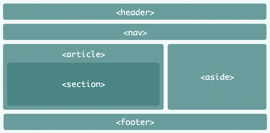

# Mini Projeto P1 - Fatec DSM

> [!IMPORTANT]
> **O que é um HTML semântico?**
> R: Semântica é a área da linguística que estuda os significados das palavras, textos e frases de uma língua. Logo HTML semântico remete-se a um conjunto de tags que seu nome faz referência a sua utilidade, exemplo evidente é a tag  \<footer\> \</footer\>, traduzida do inglês para o português significa literalmente "rodapé", e a mesma é utilizada para delimitarmos o que será um rodapé de uma página HTML.

### Exemplo de HTML semântico


##### Como este código seria escrito antes do HTML semântico

```html
<div id=header></div>
<div id=nav></div>
<div id=article>
    <div id=section>
        </div>
</div>
<div></div>
<div id=rodape></div>
```

##### Como este código é escrito depois do HTML semântico

```html
<header></header>
<nav></nav>
<article>
    <section>
    </section>
</article>
<aside></aside>
<footer></footer>
```


> [!IMPORTANT]
> **quais suas vantagens, a sua usabilidade, e explanar  principais benefícios ?**
> R: Suas vantagens são diretas, não utilizar tags genéricas e a priori sem sentido, utilizar tags que ajudarão a lerem melhor o código, tanto outras pessoas como robôs de busca, e este é um dos benefícios, os motores de busca selecionaram melhor um site que faz uso corretamente das tags semânticas, e quanto a usabilidade as tags semânticas melhoram a acessibilidade de pessoas que não enxergam, pois os leitores de telas irão ler melhor um conteúdo bem organizado semânticamente


> [!IMPORTANT]
> **explicar as diferenças entre "class", "id" e "tags" no contexto do CSS**
> R: Temos três formas de aplicar uma estilização em elementos HTML, utilizando o seletor de **tag**, **class** e **id**. Por **"tag"** iremos estilizar todos elementos do nosso HTML que corresponda a ela, por **"class"** iremos estilizar todos elementos do nosso HTML que tenham a mesma como propriedade em sua **tag** de abertura, ou seja assim como por **tag** podemos estilizar mais de um elemento, mas diferente pois podemos estilizar diferentes elementos de **tags** distintas mas que tenham como propriedade a **class** em comum, por **"id"** podemos estilizar apenas um elemento, apenas o elemento que tenha este como propriedade em sua **tag** de abertura, sendo único em todo código HTML e CSS 